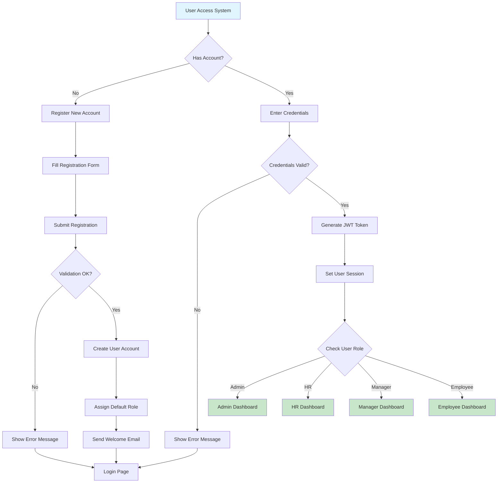
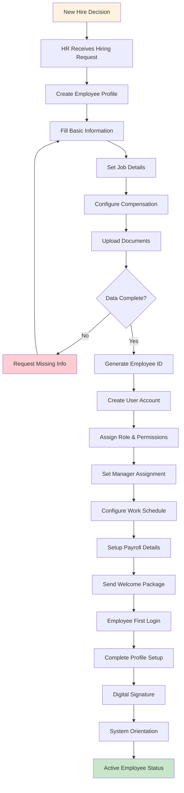
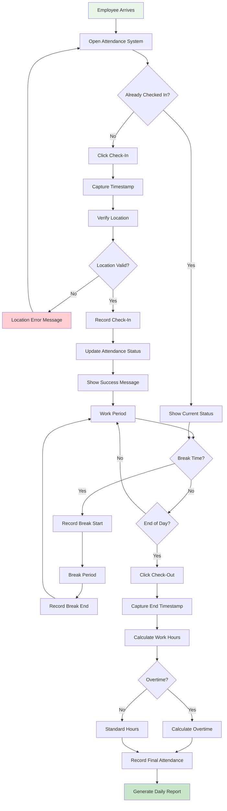
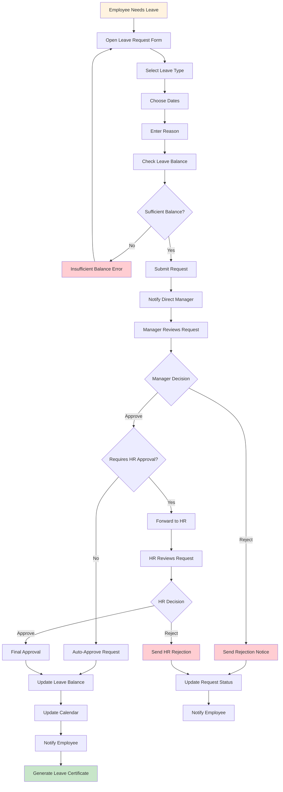
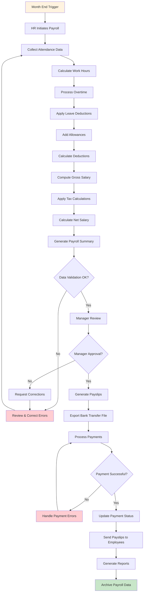
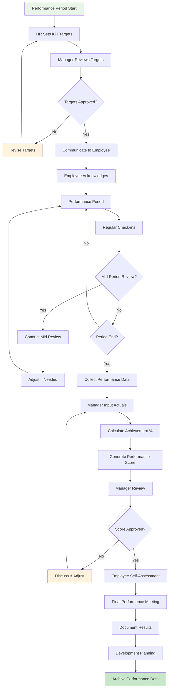
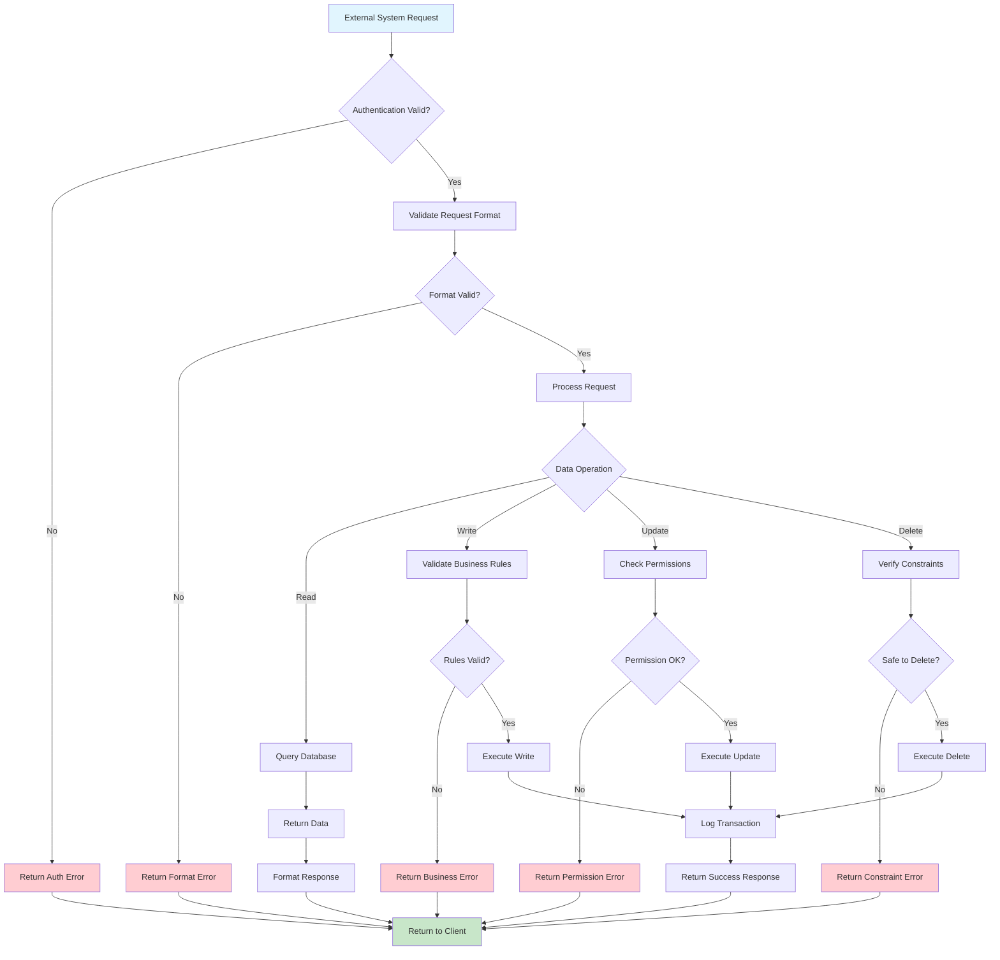
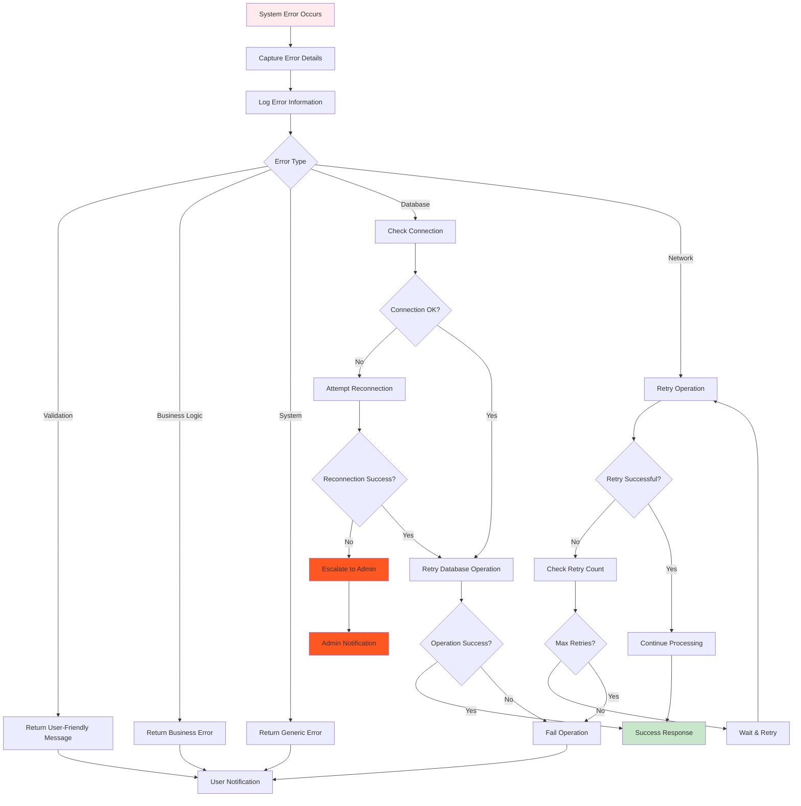
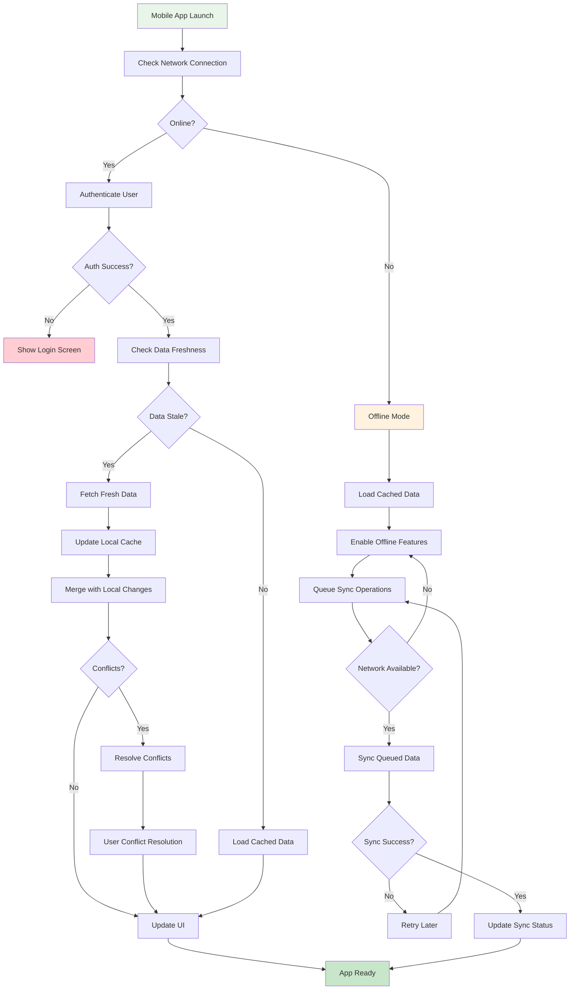
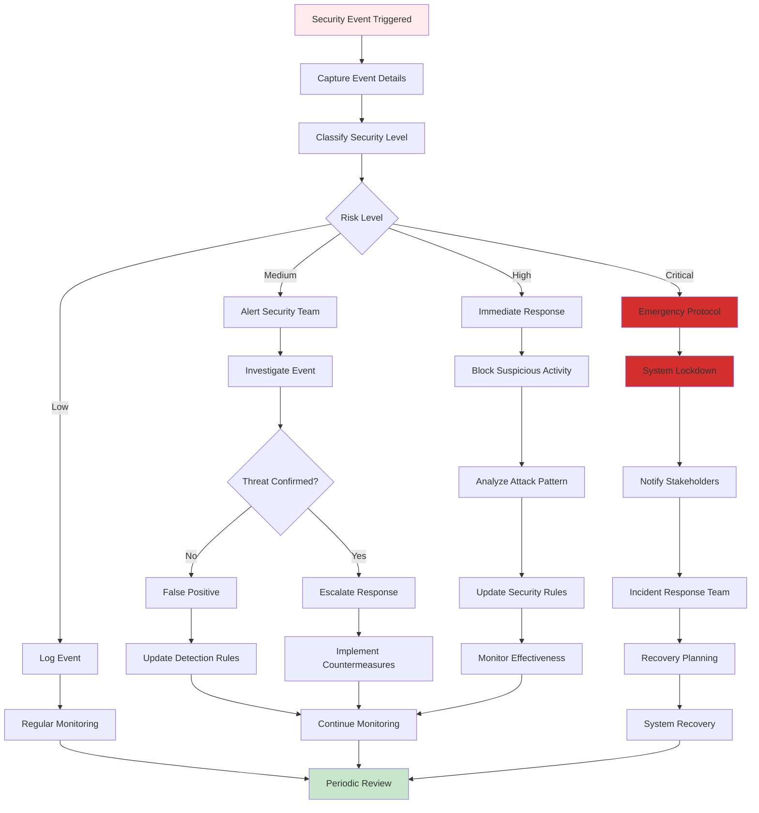

# 🔄 SYSTEM FLOWCHARTS
## HRIS Process Flow Diagrams

---

## 🎯 OVERVIEW
Dokumentasi visual untuk semua proses bisnis utama dalam sistem HRIS, menggambarkan alur kerja dari input hingga output dengan decision points dan exception handling.

---

## 🔐 1. USER AUTHENTICATION FLOW

### Process Description:
1. **Entry Point**: User accesses the system
2. **Authentication**: Credential validation
3. **Authorization**: Role-based dashboard routing
4. **Session Management**: JWT token generation and validation

---

## 👥 2. EMPLOYEE ONBOARDING FLOW

### Key Decision Points:
- **Data Completeness**: Ensures all required information is captured
- **Role Assignment**: Determines system access levels
- **Manager Assignment**: Establishes reporting hierarchy

---

## ⏰ 3. DAILY ATTENDANCE FLOW

### Automation Features:
- **Location Verification**: GPS/IP-based validation
- **Overtime Calculation**: Automatic computation
- **Break Time Tracking**: Optional break period recording

---

## 🏖️ 4. LEAVE REQUEST WORKFLOW

### Approval Matrix:
- **1-3 days**: Manager approval only
- **4-7 days**: Manager + HR approval
- **8+ days**: Manager + HR + Director approval

---

## 💰 5. MONTHLY PAYROLL PROCESSING

### Validation Checkpoints:
- **Data Integrity**: Attendance vs payroll data consistency
- **Calculation Accuracy**: Mathematical validation
- **Approval Gates**: Multi-level approval process

---

## 📊 6. KPI EVALUATION PROCESS

### Performance Metrics:
- **Quantitative KPIs**: Measurable targets (sales, productivity)
- **Qualitative KPIs**: Behavioral assessments
- **Development Goals**: Skill improvement targets

---

## 🔄 7. SYSTEM INTEGRATION FLOW

### Integration Points:
- **Banking APIs**: Salary transfer processing
- **Email Services**: Notification delivery
- **Time Clock Systems**: Attendance data sync
- **Accounting Systems**: Financial data exchange

---

## 🚨 8. ERROR HANDLING & RECOVERY FLOW

### Error Categories:
- **User Errors**: Invalid input, validation failures
- **Business Errors**: Rule violations, insufficient permissions
- **System Errors**: Server issues, database problems
- **Network Errors**: Connectivity issues, timeouts

---

## 📱 9. MOBILE APP SYNC FLOW

### Sync Strategy:
- **Real-time**: Critical data (attendance, approvals)
- **Periodic**: Regular data (employee info, schedules)
- **On-demand**: Large data sets (reports, analytics)

---

## 🔒 10. SECURITY AUDIT FLOW

### Security Monitoring:
- **Login Attempts**: Failed authentication tracking
- **Data Access**: Unusual data access patterns
- **System Changes**: Configuration modifications
- **Network Activity**: Suspicious network traffic

---

## 📋 FLOWCHART LEGEND

### Symbols Used:
- **🟢 Start/End**: Process initiation and completion points
- **🔷 Process**: Standard processing steps
- **🔶 Decision**: Decision points with Yes/No branches
- **🔴 Error**: Error conditions and handling
- **🟡 Warning**: Caution points requiring attention
- **📊 Data**: Data storage or retrieval operations

### Color Coding:
- **Green**: Success states and completion
- **Red**: Error states and failures
- **Yellow**: Warning states and attention points
- **Blue**: Information and processing states
- **Orange**: Decision points and branching

---

## ✅ PROCESS VALIDATION CHECKLIST

### Flow Completeness:
- [ ] All entry points identified
- [ ] All exit points defined
- [ ] Decision branches covered
- [ ] Error handling included

### Business Logic:
- [ ] Business rules implemented
- [ ] Approval workflows defined
- [ ] Validation checkpoints included
- [ ] Exception handling covered

### User Experience:
- [ ] User-friendly error messages
- [ ] Clear process feedback
- [ ] Intuitive navigation flow
- [ ] Mobile-responsive design

### Technical Implementation:
- [ ] Database transactions defined
- [ ] API endpoints mapped
- [ ] Security checkpoints included
- [ ] Performance considerations addressed